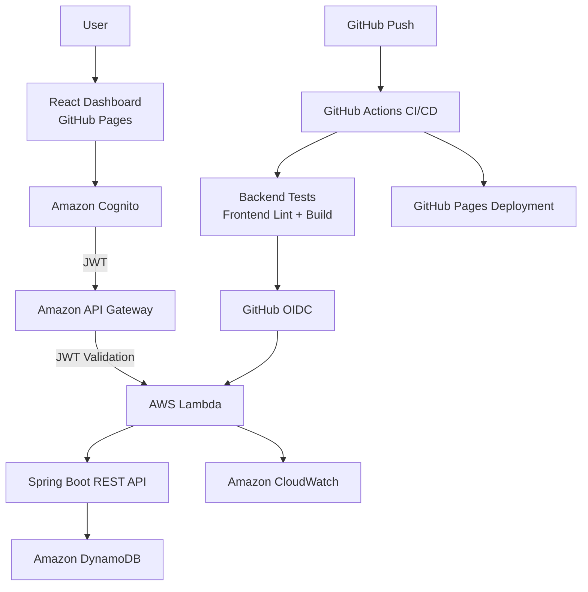

# CloudOps

[](https://github.com/RipLiquid/CloudOps/actions/workflows/ci.yml)

**CloudOps** is a cloud-native incident management platform built with Java, Spring Boot, React, and AWS.

It demonstrates full-stack development, serverless architecture, secure authentication, cloud persistence, automated testing, CI/CD, and secure GitHub-to-AWS deployment using OpenID Connect (OIDC).

**Live Application:** https://ripliquid.github.io/CloudOps/

> Authentication is required to access the incident dashboard.

## Dashboard


## Architecture



Users authenticate through Amazon Cognito and receive a short-lived JWT. API Gateway validates the token before requests reach the Lambda-hosted Spring Boot API.

The backend accesses DynamoDB through a least-privilege IAM execution role. GitHub Actions deploys the Lambda through OIDC using temporary AWS credentials rather than stored AWS access keys.

## Features

- Secure authentication with Amazon Cognito
- JWT-protected REST API
- Create, view, update, and delete incidents
- UUID-based incident identifiers
- Severity and status classification
- Incident ownership
- Dashboard statistics
- Responsive React interface
- DynamoDB persistence
- Serverless Java backend on AWS Lambda
- API Gateway routing and authorization
- CloudWatch logging
- Input validation
- Automated Java tests
- Frontend linting and production builds
- GitHub Actions CI/CD
- Automated Lambda deployment
- GitHub-to-AWS authentication using OIDC
- Automated GitHub Pages deployment
- Restricted CORS configuration
- Docker configuration

## Technology Stack

### Frontend

- React
- Vite
- JavaScript
- CSS
- AWS Amplify
- Amazon Cognito
- GitHub Pages

### Backend

- Java 21
- Spring Boot
- Spring Web MVC
- Jakarta Validation
- Maven
- AWS SDK for Java 2.x
- AWS Serverless Java Container

### AWS

- AWS Lambda
- Amazon API Gateway
- Amazon DynamoDB
- Amazon Cognito
- AWS IAM
- Amazon CloudWatch

### DevOps & Testing

- GitHub Actions
- OpenID Connect (OIDC)
- Docker
- JUnit
- Mockito
- MockMvc
- ESLint
- Maven
- npm

## Incident Model

| Field | Description |
|---|---|
| `id` | Automatically generated UUID |
| `title` | Incident title |
| `description` | Detailed incident description |
| `severity` | Operational severity |
| `status` | Current incident status |
| `owner` | Person responsible for the incident |

### Severity

`LOW` · `MEDIUM` · `HIGH` · `CRITICAL`

### Status

`OPEN` · `INVESTIGATING` · `RESOLVED` · `CLOSED`

## REST API

| Method | Endpoint | Description |
|---|---|---|
| `GET` | `/api/incidents` | Retrieve all incidents |
| `GET` | `/api/incidents/{id}` | Retrieve an incident |
| `POST` | `/api/incidents` | Create an incident |
| `PUT` | `/api/incidents/{id}` | Update an incident |
| `DELETE` | `/api/incidents/{id}` | Delete an incident |

All deployed routes require a valid Cognito JWT.

## Security

CloudOps was designed without permanent AWS credentials in application code or GitHub.

### Authentication

Users authenticate through Amazon Cognito. The frontend sends the resulting JWT with API requests:

```http
Authorization: Bearer <JWT>
```

API Gateway validates the JWT before forwarding requests to Lambda.

Unauthenticated requests are rejected with:

```text
401 Unauthorized
```

### Least-Privilege IAM

The Lambda execution role is limited to the DynamoDB operations required by the application:

```text
dynamodb:GetItem
dynamodb:PutItem
dynamodb:DeleteItem
dynamodb:Scan
```

Access is restricted to the CloudOps DynamoDB table.

### GitHub → AWS OIDC

GitHub Actions does not store an AWS access key or secret access key.

Deployment uses:

```text
GitHub Actions
      |
      v
GitHub OIDC Token
      |
      v
AWS STS
      |
      v
Temporary AWS Credentials
      |
      v
CloudOpsGitHubDeployRole
      |
      v
CloudOpsApi Lambda
```

The deployment IAM role is restricted to the CloudOps repository and deployment permissions required for the Lambda function.

### CORS

API Gateway only allows browser requests from approved development and production frontend origins.

## CI/CD Pipeline

Every push to `main` automatically runs:

```text
                    git push
                        |
            +-----------+-----------+
            |                       |
            v                       v
      Backend Tests          Frontend Checks
            |                 lint + build
            +-----------+-----------+
                        |
              +---------+---------+
              |                   |
              v                   v
       Deploy AWS Lambda    Deploy GitHub Pages
              |
              v
       GitHub OIDC → AWS
```

The pipeline:

1. Checks out the repository
2. Configures Java 21 and Node.js
3. Runs the backend test suite
4. Runs ESLint
5. Builds the React production bundle
6. Packages the Lambda application
7. Authenticates to AWS using OIDC
8. Updates the Lambda function
9. Verifies the Lambda deployment
10. Builds and deploys the frontend to GitHub Pages

## Project Structure

```text
CloudOps/
├── .github/
│   └── workflows/
│       └── ci.yml
│
├── frontend/
│   ├── src/
│   │   ├── App.jsx
│   │   ├── App.css
│   │   ├── amplify.js
│   │   └── main.jsx
│   ├── package.json
│   └── vite.config.js
│
├── src/
│   ├── main/
│   │   ├── java/io/github/ripliquid/cloudops/
│   │   │   ├── config/
│   │   │   ├── controller/
│   │   │   ├── lambda/
│   │   │   ├── model/
│   │   │   ├── repository/
│   │   │   └── service/
│   │   └── resources/
│   └── test/
│
├── images/
├── Dockerfile
├── pom.xml
└── README.md
```

## Local Development

### Backend

```powershell
.\mvnw.cmd spring-boot:run
```

Local API:

```text
http://localhost:8080
```

### Frontend

```powershell
cd frontend
npm install
npm run dev
```

Local frontend:

```text
http://localhost:5173
```

Create `frontend/.env.local`:

```env
VITE_COGNITO_USER_POOL_ID=your-user-pool-id
VITE_COGNITO_CLIENT_ID=your-client-id
VITE_API_URL=your-api-gateway-url
```

Passwords, JWTs, AWS access keys, and other sensitive credentials should never be committed.

## Testing

Backend:

```powershell
.\mvnw.cmd test
```

Frontend:

```powershell
cd frontend
npm run lint
npm run build
```

These checks are also automatically executed by GitHub Actions.

## Observability

AWS Lambda sends application logs to Amazon CloudWatch, providing visibility into:

- Lambda initialization
- Spring Boot startup
- API requests
- Runtime exceptions
- Invocation duration
- Function failures

## Current Status

CloudOps currently includes:

- Full CRUD incident management
- Public React deployment
- AWS-hosted Java backend
- DynamoDB persistence
- Cognito authentication
- JWT API authorization
- GitHub Actions CI/CD
- GitHub → AWS OIDC authentication
- Automated Lambda deployment
- Automated GitHub Pages deployment
- CloudWatch logging
- Automated testing

## Future Improvements

- Incident search and filtering
- Incident timestamps
- Audit history
- Role-based authorization
- Additional CloudWatch metrics and alarms

## What This Project Demonstrates

CloudOps demonstrates practical experience with:

- Full-stack software engineering
- Java and Spring Boot
- React
- REST API design
- AWS serverless architecture
- Authentication and authorization
- NoSQL cloud databases
- IAM and least-privilege security
- CI/CD
- OIDC federation
- Automated cloud deployment
- Automated testing
- Production frontend hosting
