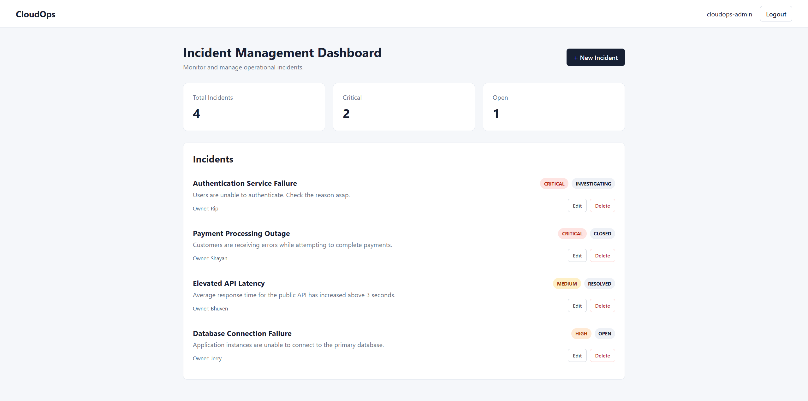
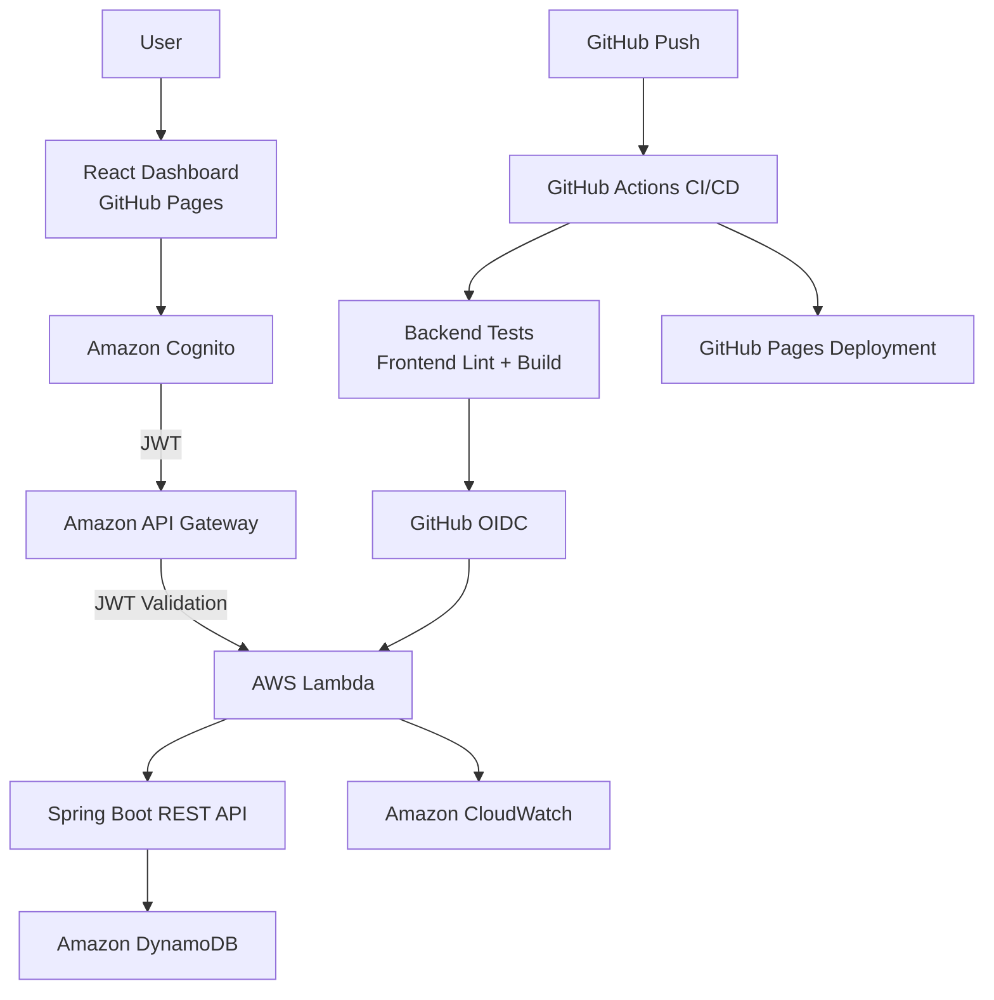

# CloudOps

[](https://github.com/RipLiquid/CloudOps/actions/workflows/ci.yml)

**CloudOps** is a cloud-native incident management platform built with Java, Spring Boot, React, and AWS.

It demonstrates full-stack development, serverless architecture, secure authentication, cloud persistence, containerization, automated testing, CI/CD, and secure GitHub-to-AWS deployment using OpenID Connect (OIDC).

**Live Application:** https://ripliquid.github.io/CloudOps/

## Public Demo Access

A public Amazon Cognito account is available for recruiters and portfolio reviewers who want to explore the deployed application.

```text
Username: cloudops-demo
Password: CloudOpsDemo!2026
```

The public account belongs to the `DemoUsers` Amazon Cognito group. Administrative identities are kept separately in the `Admins` group.

> The demo environment is shared. Please do not enter sensitive or personal information.

## Dashboard



## Architecture



Users authenticate through Amazon Cognito and receive a short-lived JWT. API Gateway validates the token before requests reach the Lambda-hosted Spring Boot backend.

The backend accesses DynamoDB through a least-privilege IAM execution role without storing permanent AWS access keys in application code.

GitHub Actions authenticates to AWS through OIDC and receives temporary AWS credentials for automated Lambda deployment.

---

## Features

- Secure authentication with Amazon Cognito
- Public demo account for portfolio review
- Cognito `Admins` and `DemoUsers` groups
- JWT-protected REST API
- Create incidents
- View incidents
- Update incidents
- Delete incidents
- UUID-based incident identifiers
- Incident severity classification
- Incident status tracking
- Incident ownership
- Dashboard statistics
- Responsive React interface
- DynamoDB cloud persistence
- Serverless Java backend with AWS Lambda
- API Gateway integration
- CloudWatch logging
- Input validation
- Automated backend tests
- Frontend linting and production builds
- GitHub Actions CI/CD
- Automated Lambda deployment
- GitHub-to-AWS OIDC authentication
- Automated GitHub Pages deployment
- Restricted CORS configuration
- Dockerized Spring Boot backend
- Separate Docker and AWS Lambda deployment packages

---

## Technology Stack

### Frontend

- React
- Vite
- JavaScript
- CSS
- AWS Amplify
- Amazon Cognito
- GitHub Pages

### Backend

- Java 21
- Spring Boot
- Spring Web MVC
- Jakarta Validation
- Maven
- AWS SDK for Java 2.x
- AWS Serverless Java Container

### AWS

- AWS Lambda
- Amazon API Gateway
- Amazon DynamoDB
- Amazon Cognito
- AWS IAM
- AWS STS
- Amazon CloudWatch

### DevOps & Testing

- GitHub Actions
- OpenID Connect (OIDC)
- Docker
- Maven
- npm
- ESLint
- JUnit
- Mockito
- MockMvc

---

## Incident Model

Each incident contains:

| Field | Description |
|---|---|
| `id` | Automatically generated UUID |
| `title` | Incident title |
| `description` | Detailed incident description |
| `severity` | Operational severity |
| `status` | Current incident status |
| `owner` | Person responsible for the incident |

### Severity Levels

```text
LOW
MEDIUM
HIGH
CRITICAL
```

### Incident Statuses

```text
OPEN
INVESTIGATING
RESOLVED
CLOSED
```

---

## REST API

| Method | Endpoint | Description |
|---|---|---|
| `GET` | `/api/incidents` | Retrieve all incidents |
| `GET` | `/api/incidents/{id}` | Retrieve an incident by ID |
| `POST` | `/api/incidents` | Create an incident |
| `PUT` | `/api/incidents/{id}` | Update an existing incident |
| `DELETE` | `/api/incidents/{id}` | Delete an incident |

All deployed API routes require a valid Cognito JWT.

---

# Security

Security is built into the CloudOps architecture.

## Amazon Cognito Authentication

Users authenticate through Amazon Cognito.

After successful authentication, the React frontend receives a temporary JWT and sends it with API requests:

```http
Authorization: Bearer <JWT>
```

API Gateway validates the token before forwarding requests to AWS Lambda.

Unauthenticated requests are rejected with:

```text
401 Unauthorized
```

---

## Cognito User Groups

CloudOps separates application identities using Amazon Cognito groups:

```text
Admins
DemoUsers
```

The public portfolio account belongs to:

```text
DemoUsers
```

Administrative identities belong to:

```text
Admins
```

These groups provide the identity structure for group-based application authorization.

---

## No Hard-Coded AWS Credentials

CloudOps does not store AWS access keys in:

- Java source code
- React source code
- Docker images
- GitHub source files
- Application configuration committed to the repository

AWS Lambda receives temporary credentials automatically through its IAM execution role.

GitHub Actions receives temporary AWS credentials through OIDC.

---

## Least-Privilege Lambda IAM

The Lambda execution role is restricted to the DynamoDB operations required by CloudOps:

```text
dynamodb:GetItem
dynamodb:PutItem
dynamodb:DeleteItem
dynamodb:Scan
```

Access is restricted to the CloudOps DynamoDB table.

---

## GitHub-to-AWS OIDC

CloudOps does not store permanent AWS access keys in GitHub Actions.

Deployment uses:

```text
GitHub Actions
      |
      v
GitHub OIDC Token
      |
      v
AWS STS
      |
      v
Temporary AWS Credentials
      |
      v
CloudOpsGitHubDeployRole
      |
      v
CloudOpsApi Lambda
```

The deployment IAM role is restricted to the CloudOps repository and the AWS Lambda permissions required by the CI/CD pipeline.

This removes the need to store an AWS access key and secret access key in GitHub.

---

## CORS

API Gateway CORS configuration restricts browser requests to approved frontend origins.

Development:

```text
http://localhost:5173
```

Production:

```text
https://ripliquid.github.io
```

---

# CI/CD Pipeline

Every push to `main` automatically executes the CloudOps CI/CD pipeline.

```text
                    git push
                        |
            +-----------+-----------+
            |                       |
            v                       v
      Backend Tests          Frontend Checks
            |                 lint + build
            +-----------+-----------+
                        |
              +---------+---------+
              |                   |
              v                   v
       Deploy AWS Lambda    Deploy GitHub Pages
              |
              v
       GitHub OIDC → AWS
```

The pipeline:

1. Checks out the repository
2. Configures Java 21
3. Configures Node.js
4. Runs backend tests
5. Runs ESLint
6. Builds the React frontend
7. Builds the dedicated Lambda deployment JAR
8. Authenticates to AWS using OIDC
9. Deploys the Lambda function
10. Waits for the Lambda update
11. Verifies the Lambda deployment
12. Builds the production React frontend
13. Uploads the GitHub Pages artifact
14. Deploys the frontend to GitHub Pages

---

# Application Packaging

CloudOps creates separate deployment artifacts for AWS Lambda and traditional Java execution.

After running:

```powershell
.\mvnw.cmd clean package
```

Maven produces:

```text
cloudops-0.0.1-SNAPSHOT.jar
cloudops-0.0.1-SNAPSHOT-lambda.jar
```

### Spring Boot JAR

```text
cloudops-0.0.1-SNAPSHOT.jar
```

The normal executable Spring Boot JAR includes the embedded web server and can be used for:

- Local execution
- Docker
- Traditional Java hosting

### Lambda JAR

```text
cloudops-0.0.1-SNAPSHOT-lambda.jar
```

The Lambda-specific shaded JAR is optimized for the AWS Lambda deployment and used automatically by GitHub Actions.

This keeps the Docker runtime and serverless runtime independent from one another.

---

# Project Structure

```text
CloudOps/
|
|-- .github/
|   `-- workflows/
|       `-- ci.yml
|
|-- frontend/
|   |-- src/
|   |   |-- App.jsx
|   |   |-- App.css
|   |   |-- amplify.js
|   |   `-- main.jsx
|   |
|   |-- package.json
|   |-- package-lock.json
|   `-- vite.config.js
|
|-- src/
|   |-- main/
|   |   |-- java/io/github/ripliquid/cloudops/
|   |   |   |-- config/
|   |   |   |-- controller/
|   |   |   |-- lambda/
|   |   |   |-- model/
|   |   |   |-- repository/
|   |   |   `-- service/
|   |   |
|   |   `-- resources/
|   |
|   `-- test/
|
|-- images/
|-- Dockerfile
|-- .dockerignore
|-- .gitignore
|-- pom.xml
`-- README.md
```

---

# Local Development

## Prerequisites

Install:

- Java 21
- Node.js
- npm
- Docker
- AWS CLI

Verify:

```powershell
java --version
node --version
npm --version
docker --version
aws --version
```

---

## Run the Backend

From the project root:

```powershell
.\mvnw.cmd spring-boot:run
```

The local backend runs at:

```text
http://localhost:8080
```

Health endpoint:

```text
http://localhost:8080/actuator/health
```

---

## Run the Frontend

Navigate to the frontend directory:

```powershell
cd frontend
```

Install dependencies:

```powershell
npm install
```

Start Vite:

```powershell
npm run dev
```

Open:

```text
http://localhost:5173
```

---

# Frontend Environment Configuration

Create:

```text
frontend/.env.local
```

Add:

```env
VITE_COGNITO_USER_POOL_ID=your-user-pool-id
VITE_COGNITO_CLIENT_ID=your-client-id
VITE_API_URL=your-api-gateway-url
```

These values identify application resources and are not AWS access credentials.

Passwords, JWTs, AWS access keys, secret access keys, and other sensitive credentials should never be committed to the repository.

---

# Testing

## Backend Tests

Run:

```powershell
.\mvnw.cmd test
```

The backend test suite covers:

- Service behavior
- REST controller endpoints
- Validation
- CRUD operations
- Application startup

---

## Frontend Linting

```powershell
cd frontend
npm run lint
```

---

## Frontend Production Build

```powershell
npm run build
```

Backend tests, frontend linting, and frontend production builds are also executed automatically by GitHub Actions.

---

# Docker

CloudOps uses a multi-stage Docker build with Maven and Java 21.

Build the container:

```powershell
docker build -t cloudops .
```

Run it:

```powershell
docker run --rm -p 8080:8080 cloudops
```

Verify the container:

```powershell
Invoke-RestMethod http://localhost:8080/actuator/health
```

Expected status:

```text
UP
```

The Docker image uses the executable Spring Boot JAR rather than the AWS Lambda deployment package.

---

# AWS Deployment

The deployed backend follows this architecture:

```text
API Gateway
    |
    v
AWS Lambda
    |
    v
Spring Boot
    |
    v
DynamoDB
```

Spring Boot runs inside AWS Lambda through the AWS Serverless Java Container adapter.

The Lambda-specific deployment package is created using Maven Shade and deployed automatically through GitHub Actions.

---

# Serverless Architecture

CloudOps avoids maintaining dedicated production application servers.

The serverless design provides:

- Automatic scaling
- Minimal infrastructure management
- Stateless application execution
- Cloud-native persistence
- IAM-based service authentication
- Usage-based cloud resource consumption

---

# Observability

AWS Lambda sends application logs to Amazon CloudWatch.

CloudWatch provides visibility into:

- Lambda initialization
- Spring Boot startup
- API requests
- Runtime exceptions
- Invocation duration
- Function failures

---

# Example Incident

```json
{
  "id": "e6aaf449-2886-4571-8df8-b8fafca6c07f",
  "title": "Authentication Service Failure",
  "description": "Users are unable to authenticate.",
  "severity": "CRITICAL",
  "status": "OPEN",
  "owner": "Operations Team"
}
```

---

# Current Status

CloudOps currently includes:

- Full CRUD incident management
- Public React deployment
- Public Cognito demo account
- Cognito `Admins` and `DemoUsers` groups
- AWS-hosted Java backend
- DynamoDB cloud persistence
- Cognito authentication
- JWT API authorization
- GitHub Actions CI/CD
- GitHub-to-AWS OIDC authentication
- Automated Lambda deployment
- Automated GitHub Pages deployment
- Separate Docker and Lambda JAR packaging
- Docker container support
- Spring Boot Actuator health checks
- CloudWatch logging
- Automated testing

---

# What This Project Demonstrates

CloudOps demonstrates practical experience with:

- Full-stack software engineering
- Java and Spring Boot
- React
- REST API design
- AWS serverless architecture
- Amazon Cognito authentication
- JWT authorization
- Cognito identity groups
- NoSQL cloud databases
- IAM and least-privilege security
- AWS STS
- GitHub Actions CI/CD
- OIDC federation
- Automated AWS deployment
- Docker containerization
- Automated testing
- Production frontend hosting
- Cloud observability
